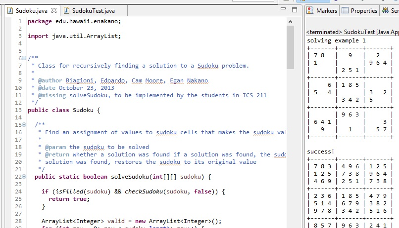

The Sudoku solver is a Java program that I created as an assignment in ICS 211, Spring 2015. The project helped me learn how to design and implement a recursive algorithm and gave me more experience with Java. Additionally this was the first time I actually had hands on experince with a Sudoku problem.

The Sudoku solver was implemented using Eclipse, a popular integrated development platform. Portions of the program had been predesigned by the instructor, but the main puzzle solving logic portion of the program was left to me to complete. Within the week or so given to complete the assignment, my implementation of the solver was working quickly and effeciantly. 

 In this project I gained experience with implementing a recursive fucntion, Java programming, collaborative work, and how to sovle a Sudoku puzzle. 
 
